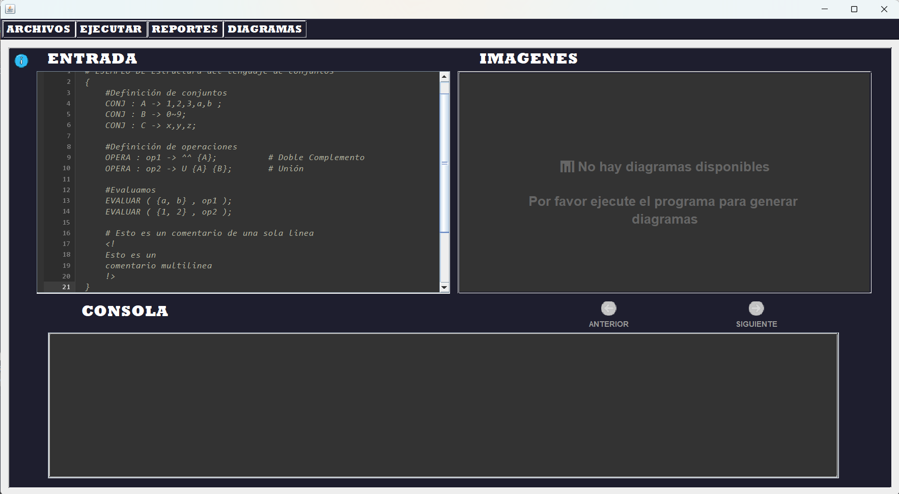
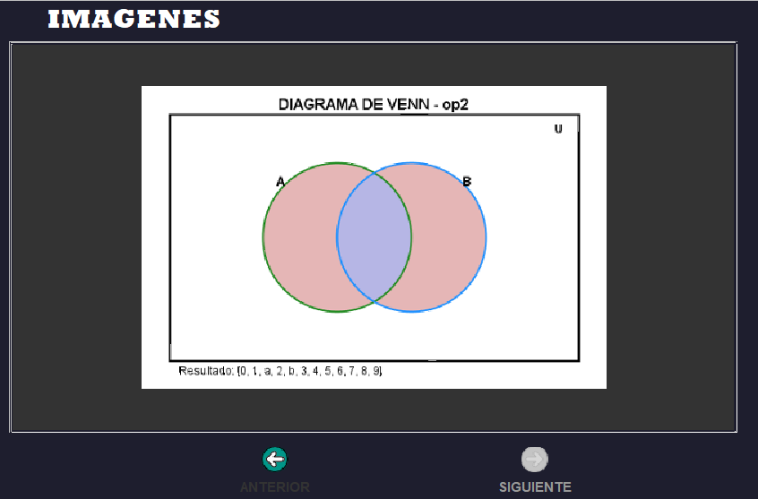
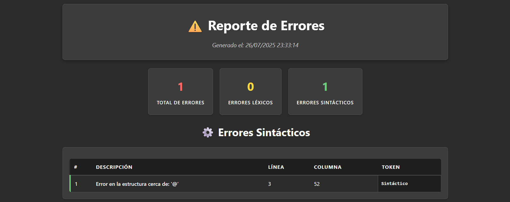
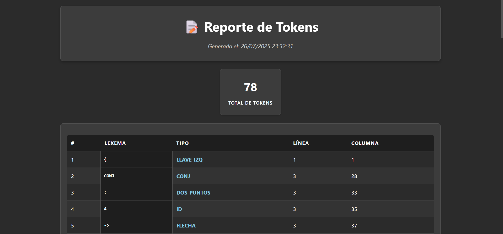

# 🔢 CONJANALYZER: ¡Analizador de Conjuntos Inteligente! 🚀

---

## ✨ ¿Qué es CONJANALYZER?

<div align="center">
  
  > **"Un analizador léxico y sintáctico especializado en operaciones avanzadas de conjuntos con soporte completo para el álgebra de Boole y visualización inteligente mediante diagramas de Venn"**
  
  🎯 **¡Procesa conjuntos simultáneamente, visualiza hasta 4, y simplifica usando leyes algebraicas!** 🎯
  
</div>

<div align="center">

### 🚀 Características Principales

| Característica | Descripción |
|:---:|:---:|
| 🔍 **Análisis Léxico** | Tokenización precisa con JFlex |
| 📝 **Análisis Sintáctico** | Parsing robusto con Java Cup |
| 🎨 **Diagramas de Venn** | Visualización automática hasta 4 conjuntos |
| ⚡ **Evaluación** | Verificación de elementos en conjuntos |
| 🧮 **Álgebra de Boole** | Soporte completo para todas las leyes |
| 📊 **Reportes HTML** | Tokens y errores en formato web |
| 🔄 **Simplificación JSON** | Optimización con  leyes algebraicas |
| 🎯 **Operaciones Complejas** | Procesamiento de  conjuntos simultáneos |

</div>

---

## 👨‍💻 Desarrollador

<div align="center">

<table align="center">
<tr>
<td align="center" width="100%">

**🚀 HÉCTOR DANIEL ORTIZ OSORIO**  
*Developer & System Architect*  
[](https://github.com/DaaNiieeL123)

</td>
</tr>
</table>

</div>

---

## 🛠️ Stack Tecnológico

<div align="center">

<table align="center">
<tr>
<td align="center" width="33%">

### **Java** ☕
<div align="center">
  
</div>

**¿Por qué Java?**
- ⚡ Multiplataforma robusto
- 🔄 Gestión automática de memoria  
- 🛡️ Tipado fuerte y seguro
- 📦 Ecosistema maduro

</td>
<td align="center" width="33%">

### **JFlex** 🧩
<div align="center">
  
</div>

**Su Superpoder:**
- 🧠 Análisis léxico preciso
- 📝 Generación automática de lexers
- 🔍 Reconocimiento de patrones
- 🌍 Integración perfecta con Java

</td>
<td align="center" width="33%">

### **Java Cup** ✨
<div align="center">
  
</div>

**La Magia del Parsing:**
- 🎨 Análisis sintáctico LALR
- 📱 Generación de parsers
- ⚡ Manejo de errores avanzado
- 🎯 Integración con JFlex

</td>
</tr>
</table>

</div>

---

## 📝 Sintaxis del Lenguaje CONJANALYZER

<div align="center">

### 🔧 **Palabras Reservadas**

| Palabra | Descripción | Ejemplo |
|:---:|:---:|:---:|
| `CONJ` | Define un conjunto | `CONJ : A -> 1,2,3,4,5 ;` |
| `OPERA` | Realiza operaciones | `OPERA : resultado -> A U B ;` |
| `EVALUAR` | Evalúa un elemento | `EVALUAR ( {3} , resultado );` |

### ⚡ **Operadores de Conjuntos (Notación Polaca/Prefijo)**

| Operador | Operación | Descripción | Ejemplo |
|:---:|:---:|:---:|:---:|
| `U` | Unión | Une dos conjuntos | `U {A} {B}` |
| `&` | Intersección | Elementos comunes | `& {A} {B}` |
| `^` | Complemento | Elementos no pertenecientes | `^ {A}` |
| `-` | Diferencia | Elementos de A que no están en B | `- {A} {B}` |
| `~` | Rango | Define secuencias: números, letras, caracteres | `0~9`, `a~z`, `!~}`, `A~Z` |

### 🧮 **Capacidades Avanzadas del Sistema**

<div align="center">

| Capacidad | Límite/Característica | Descripción |
|:---:|:---:|:---:|
| **Conjuntos Simultáneos** | 4+ conjuntos | Procesa operaciones complejas sin límite teórico |
| **Visualización Venn** | Hasta 4 conjuntos | Diagramas claros y navegables (limitado por claridad visual) |
| **Leyes Algebraicas** | 10+ leyes soportadas | Idempotencia, De Morgan, Absorción, Distributiva, etc. |
| **Simplificación** | Automática | Optimización en tiempo real con reportes JSON |
| **Operaciones Anidadas** | Sin límite | Soporta expresiones complejas: `^ U & {A} {B} & {C} {D}` |
| **Tipos de Elementos** | Mixtos | Números, letras, caracteres ASCII, rangos combinados |

</div>

</div>

### 📊 **Ejemplos de Sintaxis **

#### 🎯 **Ejemplo Básico - Operaciones Fundamentales**
```ca
{
    # Definición de conjuntos con diferentes tipos de rangos
    CONJ : A -> 1,2,3,a,b ;
    CONJ : B -> 0~9 ;        # Rango numérico: {0,1,2,3,4,5,6,7,8,9}
    CONJ : C -> a~z ;        # Rango de letras: {a,b,c,...,x,y,z}
    CONJ : D -> !~} ;        # Rango de caracteres ASCII desde ! hasta }

    # Operaciones básicas en NOTACIÓN POLACA (PREFIJO)
    OPERA : union -> U {A} {B} ;       # Unión de A y B
    OPERA : interseccion -> & {A} {C} ; # Intersección de A y C
    OPERA : complemento -> ^ {A} ;      # Complemento de A
    OPERA : diferencia -> - {B} {A} ;   # Diferencia B - A

    # Evaluaciones
    EVALUAR ( {a, b} , union );
    EVALUAR ( {1, 2} , interseccion );
}
```

**📋 Para más ejemplos detallados, consulta la carpeta [Examples/](./Examples/)**

---

## 📸 Capturas de Pantalla

### 🎨 **Interfaz Principal**
<div align="center">
  
  <p><em>Editor principal con syntax highlighting, consola integrada y navegador de diagramas</em></p>
</div>

### 📊 **Diagramas de Venn Generados**
<div align="center">
  
  <p><em>Los diagramas de Venn se generan automáticamente y se pueden navegar con los controles integrados</em></p>
</div>

### 📋 **Reportes HTML**
<div align="center">
  
  <p><em>Reportes de tokens y errores que se abren automáticamente en el navegador</em></p>
</div>

---

## 🚀 Instalación y Uso

<div align="center">

### 📋 **Requisitos del Sistema**
- **Java JRE 8 o superior** (solo para ejecutar el JAR)
- **Java JDK 8 o superior** (solo si vas a compilar desde código fuente)

### ⚡ **Ejecución Rápida (Recomendado)**

#### 🎯 **Opción 1: Usar el JAR Ejecutable (Más Fácil)**

```bash
# 1. Descarga o clona el repositorio
git clone https://github.com/DaaNiieeL123/CONJANALYZER.git

# 2. Navega al directorio del proyecto
cd CONJANALYZER

# 3. Ejecuta directamente el JAR (¡Listo para usar!)
java -jar "dist/CONJANALYZER.jar"
```

**🎉 ¡Eso es todo! La aplicación se abrirá inmediatamente.**

#### 🔧 **Opción 2: Compilar desde Código Fuente (Para Desarrolladores)**

```bash
# Si prefieres compilar tú mismo el proyecto
ant compile
ant run

# O para generar un nuevo JAR
ant clean jar
```

</div>

### 💡 **Uso Básico**

1. **📁 Abrir/Crear Archivo**: Usa `Ctrl+O` para abrir archivos `.ca`
2. **✍️ Escribir Código**: Utiliza la sintaxis de CONJANALYZER en el editor
3. **🔍 Analizar**: Presiona el botón "Analizar" para procesar el código
4. **👀 Ver Diagramas**: Navega por los diagramas generados automáticamente
5. **📊 Reportes**: Genera reportes HTML de tokens, errores y simplificaciones JSON

### 📦 **Para Distribuir tu Aplicación**

Si quieres compartir CONJANALYZER con otros usuarios:

```bash
# Comparte toda la carpeta 'dist/' que contiene:
# - CONJANALYZER.jar (archivo principal)
# - lib/ (todas las dependencias)
# - README.TXT (instrucciones básicas)

# El usuario final solo necesita ejecutar:
java -jar CONJANALYZER.jar
```

**💡 Tip**: El usuario solo necesita tener Java instalado, ¡no necesita NetBeans, Ant, ni JFlex/JavaCup!

---

## 📊 Sistema de Reportes

### 🔬 **Tipos de Reportes Disponibles**

#### 🎯 **1. Reporte de Tokens (HTML)**
- Muestra todos los tokens identificados durante el análisis léxico
- Formato HTML con tabla interactiva
- Se abre automáticamente en el navegador

#### 🚨 **2. Reporte de Errores (HTML)**
- Lista detallada de errores léxicos y sintácticos
- Categorización de errores con ubicación precisa
- Solo se genera si existen errores

#### 🔄 **3. Simplificación JSON**
- Optimización de expresiones usando álgebra de Boole
- Aplicación de leyes de De Morgan, absorción, etc.
- Formato JSON estructurado

### 📈 **Ejemplo de Reporte de Tokens**

<div align="center">
  
  <p><em>Reporte de tokens generado automáticamente en formato HTML</em></p>
</div>

### 📈 **Ejemplo de Simplificación JSON **

```json
{
  "op1": {
    "conjunto Original": "^ ^ {A}",
    "conjunto Simplificado": "{A}",
    "leyes": [
      "Ley del Doble Complemento"
    ]
  },
  "op2": {
    "conjunto Original": "U {A} {B}", 
    "conjunto Simplificado": "U {B} {A}",
    "leyes": [
      "Propiedades Conmutativas"
    ]
  },
  "op3": {
    "conjunto Original": "& {A} {A}",
    "conjunto Simplificado": "{A}",
    "leyes": [
      "Ley de Idempotencia"
    ]
  }
}
```

---

## 🧪 Testing y Casos de Prueba

<div align="center">

### ✅ **Casos Exitosos (Notación Polaca)**
```ca
{
    # Definición de conjuntos
    CONJ : A -> 1,2,3 ;
    CONJ : B -> 4,5,6 ;
    
    # Operaciones válidas en notación polaca
    OPERA : resultado -> U {A} {B} ;     # Unión de A y B
    OPERA : interseccion -> & {A} {B} ;  # Intersección de A y B
    
    # Evaluación de elementos
    EVALUAR ( {3} , resultado );
}
```

### ❌ **Casos de Error**
```ca
{
    # Error léxico: carácter inválido
    CONJ : A -> 1,2,¡,3 ;

    # Error sintáctico: notación incorrecta (no es polaca)
    OPERA : mal -> A U B ;           # ❌ INCORRECTO
    
    # Error sintáctico: operación con conjunto no definido
    OPERA : error -> U {A} {4,5} ;   # ❌ INCORRECTO - {4,5} no está definido
}
```

</div>

---

## 🔧 Solución de Problemas Comunes

<div align="center">

### 📦 **Problemas con el JAR**
- **❌ "No se puede ejecutar el JAR"**: Verificar que Java 8+ esté instalado (`java -version`)
- **🔍 "java no se reconoce como comando"**: Agregar Java al PATH del sistema
- **📁 "Archivo no encontrado"**: Asegurarse de estar en la carpeta correcta donde está `dist/CONJANALYZER.jar`

### 🖼️ **Problemas con la Aplicación**
- **🖼️ Los diagramas no se generan**: Verificar permisos de escritura y que las operaciones sean válidas
- **🔧 Error al abrir reportes HTML**: Comprobar navegador predeterminado y permisos de escritura  
- **⚡ Problemas de compilación**: Verificar Java JDK 8+ y que JFlex/Java Cup estén disponibles

### 💡 **Comandos Útiles**
```bash
# Verificar versión de Java
java -version

# Ejecutar JAR con más memoria (si es necesario)
java -Xmx512m -jar "dist/CONJANALYZER.jar"

# Ver ayuda del JAR
java -jar "dist/CONJANALYZER.jar" --help
```

</div>

---

<div align="center">

## 🔢 ¡Únete a la Revolución del Análisis de Conjuntos! 🔢

**¿Listo para analizar y visualizar conjuntos como nunca antes?**

[](https://github.com/DaaNiieeL123/CONJANALYZER)
[](https://github.com/DaaNiieeL123/CONJANALYZER/issues)
[](https://github.com/DaaNiieeL123/CONJANALYZER/releases)

---

<div align="center">

### 📊 **Estadísticas del Proyecto**


---

**Hecho por Héctor Daniel Ortiz**

*"Transformando la teoría de conjuntos en visualizaciones intuitivas, un diagrama de Venn a la vez"* 🔢📊

</div>

</div>
